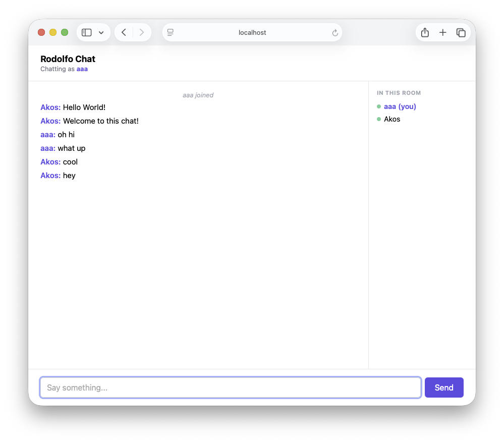

# Rodolfo

Rodolfo is a tiny [Sinatra](https://sinatrarb.com/)-inspired microframework for Kex. A router
is a block of HTTP verbs — Kex's `Block<[A]>` collection blocks turn the route
list into a plain do...end body instead of an explicit array, which keeps the
`DSL` comletely immutable:

```rb
using Rodolfo

main do
  let site = Rodolfo.router do
    get "/" do
      "Hello from Kex!"
    end

    get "/hello/:name" do |env|
      let name = env.param("name").or("world")
      "Hello, ${name}!"
    end
  end

  site.start(3000).try
end
```

`router` collects the declarations; nothing binds a socket until you `start`
it. `get`, `post`, `put`, `patch`, `delete`, `head`, and `options` are plain
functions, and `route "METHOD", path` declares anything else. A route block
that never needs the request can drop the parameter entirely — `get "/" do
"Hello from Kex!" end` — no `|_|` required.

## Installing as a `Tey` package

Rodolfo is a `Tey` package, published by tagging this repository.

Use the commands:
```sh
tey add rodolfo --git https://github.com/kexhq/rodolfo --tag "~> 0.2"
tey install
```

Or pull it in manually in your own package's `package.kex`:

```rb
tey("rodolfo", git: "https://github.com/kexhq/rodolfo", tag: "~> 0.2")
```

The tag is the release, and `~> 0.2` takes the newest `0.2.x`; Tey resolves it
against this repository's tags and records the exact commit in `tey.lock`.


## Replies

A route block that returns a `String` — or anything else showable — sends it
as a 200 `text/plain` body, which is why `do "hello" end` is a complete
route. Return one of the `Response` records to say more. Each carries a
`status` that defaults to a sensible one and `headers` that default to none,
so the usual case is a body and nothing else:

| Reply | Sends | Default status |
| --- | --- | --- |
| `Response.JSON { body }` | `application/json` | 200 |
| `Response.Text { body }` | `text/plain; charset=utf-8` | 200 |
| `Response.HTML { body }` | `text/html; charset=utf-8` | 200 |
| `Response.Raw { body, contentType }` | bytes, as you say | 200 |
| `Response.Empty {}` | no body | 204 |
| `Response.Redirect { location }` | a `Location` header | 302 |

```rb
get "/health" do
  Response.JSON { body: JSON.stringify({ "status": "ok" }) }
end

post "/things" do
  Response.Text {
    status: 201,
    body: "made",
    headers: Net.HTTP.Headers.empty.add("X-Created-By", "rodolfo").try
  }
end
```

A reply's own `Content-Type` wins; the record's kind only fills the gap, so
`Response.Text` with an explicit `application/rss+xml` sends that.

## Failing inside a route

A `.try` that fails unwinds the route block. Catch it where you can answer it,
with `trying`:

```rb
get "/api/books/:id" do |env|
  let id = Integer.parse(env.param("id").try).try
  Response.JSON { body: JSON.stringify({ "id": id }) }

rescue |e|
  Response.JSON { status: 400, body: JSON.stringify({ "error": e.message }) }
end
```

Kex attaches `rescue` to named functions, not to blocks, so a bare
`rescue` directly inside `do |env| ... end` is a syntax error — `trying` is
the form that works there.

## Plugs

A `plug` wraps every route declared in the same `router` or `scope`, so a
check that would otherwise be repeated inside each handler — response
headers, request logging, an auth gate — is written once. Write a plug as a
value (`let name = do |inner| ... end`), never as a named function passed by
name or by `~` — both currently break for a function that returns a function,
which is exactly `Plug`'s shape (`Handler -> Handler`); see
`docs/kex-issues.md` #21 if you're curious what breaks:

```rb
poweredBy : Rodolfo.Plug
let poweredBy = do |inner|
  do |env|
    match inner(env) do
      Response.Text { status, body, headers } =>
        Response.Text { status: status, body: body, headers: headers.add("X-Powered-By", "Rodolfo").or(headers) }
      reply => reply
    end
  end
end
```

`inner` is the handler (or the next plug in) being wrapped. Calling it and
using the result — as above — is an *around*-style plug: code can run before
`inner`, after it, or both, which is also how a request-logging plug looks.
`Plug.around` builds the same plug from one two-argument block instead of
the nested closures — still a closure literal, so it's exactly as safe with
respect to #21 as the form above:

```rb
poweredBy : Rodolfo.Plug
let poweredBy = Plug.around do |inner, env|
  match inner(env) do
    Response.Text { status, body, headers } =>
      Response.Text { status: status, body: body, headers: headers.add("X-Powered-By", "Rodolfo").or(headers) }
    reply => reply
  end
end
```

Not calling `inner` at all is how a plug halts a request:

```rb
requireToken : String -> Rodolfo.Plug
let requireToken(expected) = Plug.around do |inner, env|
  if env.query("token") == Just(expected)
    inner(env)
  else
    Response.Text { status: 401, body: "missing or wrong token" }
  end
end
```

`plug(...)` adds one to the router or scope it's declared in — parenthesized,
since a bare `plug someValue` without a trailing call or string doesn't
parse. Plugs run in declaration order, first-declared outermost:

```rb
Rodolfo.router do
  plug(logged)                    # every route, wrapping everything below
  plug(poweredBy)

  get "/" do Response.Text { body: "hello" } end

  scope "/admin" do
    plug(requireToken("let-me-in"))   # only routes inside this scope

    get "/stats" do Response.Text { body: "42 requests served" } end
  end
end
```

`scope "/prefix" do ... end` also prefixes every path declared inside it,
nested scopes included, and its own plugs stack after the enclosing router's
or scope's — so `/admin/stats` above runs `logged`, then `poweredBy`, then
`requireToken`, then the handler. See `examples/plugs` for the runnable
version of this.

## Composing routers

A `Router` is a value, so a large application's routes don't have to live in
one `router do ... end` body. `mount` nests an already-built router under a
path prefix — like `scope`, but the declarations were collected elsewhere:

```rb
let admin = Rodolfo.router do
  get "/stats" do "42 requests" end
end

let api = Rodolfo.router do
  mount("/admin", admin)
  get "/" do "home" end
end
```

`+` combines two routers' routes unprefixed. Each side keeps its own plugs
scoped to its own routes — `router1 + router2` does not flatten both into one
shared scope, so a plug on `router2` never reaches `router1`'s routes:

```rb
let combined = coreRoutes + adminRoutes + healthRoutes
```

## WebSocket routes

`ws` declares a route that upgrades on a completed RFC 6455 handshake,
handing the block the request environment (the same `Context` an ordinary
route gets — query string, headers, cookies) and a live `Connection` —
there's no subprotocol negotiation or handshake rejection at the handshake
itself; every request that upgrades is accepted, so reading `env` and
closing the connection right away is how a `ws` route rejects one after the
fact:

```rb
using Net.HTTP.WebSocket, only: [Message, Text, BinaryMessage, CloseMessage]

Rodolfo.router do
  ws "/echo" do |env, socket|
    loop do
      match socket.receiveMessage.try do
        Text(text) => socket.send(Text(text)).try
        CloseMessage(_, _) => break
        _ => Void
      end
    end
  end
end
```

`ws` routes take part in path prefixing exactly like any other route — one
declared inside a `scope "/api" do ... end` answers at `/api/echo` — but not
in the plug stack: a `Context -> Connection -> Void` handler isn't shaped
like a `Handler`, and an upgraded connection's lifecycle isn't a single
request/response the way an ordinary route's is.

`Message`, `Text`, `BinaryMessage`, and `CloseMessage` aren't re-exported by
`using Rodolfo` — `Text` would collide with `Response.Text` — so a `ws`
handler brings them in itself, as above. Reach for
`Net.HTTP.WebSocket.upgrade` directly from an ordinary `get` route instead of
`ws` when a client needs to negotiate a subprotocol or be rejected before the
101 response goes out.

Handing the `Connection` to another process (a shared room, a pub/sub
registry) to push to it from outside its own handler now works too —
`kexhq/kex#370` (a server-side connection couldn't be sent to while idle,
which is the normal state of a listener that isn't currently typing) is
fixed. See `examples/chat` for a broadcast room built on exactly that, with
a real browser UI, a display name per connection, and a shared room
password checked from `env.query(...)` inside the `ws` handler.

## Serving

`start` blocks, which is what a `main` wants; `background` returns a
`Server.Running` you can `stop`, which is what specs and managed lifecycles
want. Given only a port, both bind **loopback** — this machine and nothing
else:

```rb
site.start(3000).try                       # http://localhost:3000
let server = site.background(3000).try     # returns a handle
server.stop().try
```

A port bound on every interface is reachable by every machine on the network,
which is rarely what a program under development means, so widening it is a
written-out address rather than the default:

```rb
site.start("0.0.0.0", 3000).try            # every interface — the network
site.start("192.168.1.20", 3000).try       # one interface
site.start("0.0.0.0", 3000, options).try   # with Net.HTTP.ServerOptions
```

Port 0 asks the operating system for a free port, which is how a spec takes an
ephemeral one — see `spec/rodolfo.spec.kex`:

```rb
let server = site.background("127.0.0.1", 0).try
let port = server.localAddress.port.value
```

`site.httpRouter` is the `Net.HTTP.Router` the declarations compile to, for
serving it by hand or mounting it elsewhere, and `site.routes` is the compiled
route list in declaration order.

## Examples

Each example is a Kex package of its own, using Rodolfo exactly the way an
application would:

- `examples/hello` — dynamic parameters and request bodies
- `examples/statusapi` — JSON health and catalog API, with a rescued route
- `examples/website` — server-rendered HTML responses
- `examples/requestinfo` — reusable route-handler wrapping
- `examples/plugs` — request logging, response headers, and a scoped
  token-gated admin route, using `plug` and `scope`
- `examples/library` — a book-management CRUD interface: list, search, add,
  edit, delete, lend, and return, in plain HTML forms
- `examples/chat` — a broadcast WebSocket chat room with a shared room
  password and a display name per connection, using `ws` and `Plug.around`


The catalogue above is what `examples/library` serves on the first run: the
opening books from `mock_data.kex`, escaped through `html$`, with the search
box, the status pills, and the row actions the rest of the example implements.



Two browser tabs chatting with each other above — `examples/chat` serves the
login form and the room itself from `chat/views.kex`, and broadcasts each
message to every connection currently joined.

The examples are workspace members, so they resolve Rodolfo from this checkout
rather than from a published tag — one `tey install` at the root covers them:

```sh
tey install
cd examples/hello
tey run       # serves http://localhost:3000
```

The library example reads two variables: `PORT` moves it off `3000`, and
`LIBRARY_FILE` names the tab-separated file its catalogue is kept in
(`books.tsv` by default, written with fourteen books on the first run):

```sh
cd examples/library
PORT=4000 LIBRARY_FILE=/tmp/books.tsv tey run
```

`tey test` in an example runs its `spec/` directory: `examples/library` has
specs for its pure catalogue rules, its pages' escaping, and its file store.

## Develop

```sh
tey install   # fetch dependencies
tey build     # compile src/ into ebin/
tey test      # run spec/*.spec.kex on the BEAM
```

Rodolfo needs Kex `>= 0.4.0-beta.2`; pick a toolchain with `tey kex install`.
The floor is not cosmetic: before that release an application function could
displace a library's `private do` helper of the same name and arity, which
silently disabled the escaping behind `html$`. `spec/rodolfo.spec.kex` defines
`rendered`, `interleave`, and `field` at the top precisely to collide with
Rodolfo's internals, and those cases fail on an older toolchain.

## Release it

```sh
git tag -a v0.2.0 -m "Rodolfo 0.2.0" && git push origin v0.2.0
```

The tag is the release — `tey add ... --tag "~> 0.2"` resolves against it.
Keep the tag in step with `version` in `package.kex`.
