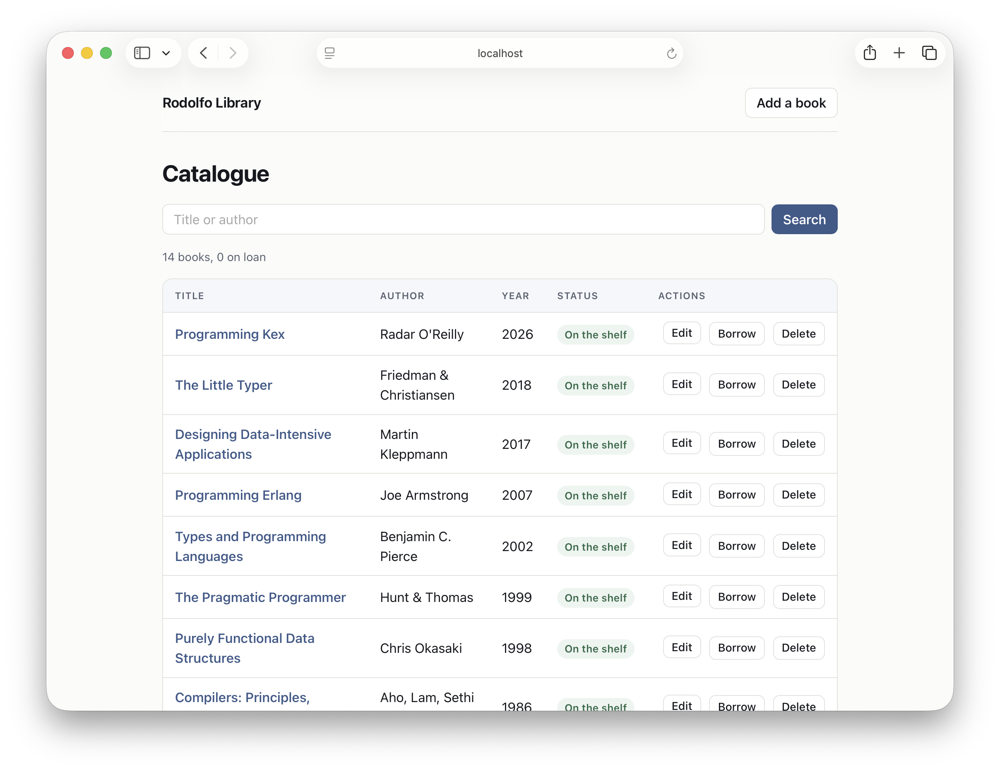

# Library

A complete book-management interface — list, search, add, edit, delete, lend,
and return — served as plain HTML forms. It is the largest Rodolfo example:
five modules, a file-backed catalogue, and a spec suite.



## Running it

```sh
tey install
tey run        # http://localhost:3000/books
```

Three environment variables move it:

| Variable | Effect |
| --- | --- |
| `PORT` | the port to listen on (default `3000`) |
| `HOST` | the address to bind — `127.0.0.1` by default; `0.0.0.0` opens it to the network |
| `LIBRARY_FILE` | where the catalogue lives (default `books.tsv` beside the process) |

```sh
HOST=0.0.0.0 tey run     # reachable from a phone on the same network
```

The first run seeds the catalogue from `src/mock_data.kex`; after that the
file on disk is the catalogue, and deleting it seeds a fresh one.

## It is part of the Rodolfo monorepo

This example is a member of the checkout's Tey workspace (see the root
`package.kex`), so its own `package.kex` resolves Rodolfo from this checkout
rather than from a published release:

```rb
tey("rodolfo", workspace: true)
```

That line only works inside the workspace. Copied out of the monorepo, the
example stops installing until `package.kex` points at a release instead, the
way any other package would:

```rb
tey("rodolfo", git: "https://github.com/kexhq/rodolfo", tag: "~> 0.2")
```

or `tey add rodolfo --git https://github.com/kexhq/rodolfo --tag "~> 0.2"`,
then `tey install` again.

## Layout

| File | Owns |
| --- | --- |
| `src/main.kex` | the routes: HTTP in, replies out |
| `src/catalog/book.kex` | the `Book` record, its `BookId`, and what one book knows how to do |
| `src/catalog/books.kex` | the catalogue operations on `[Book]`, and the tab-separated file format |
| `src/catalog/draft.kex` | form input as it arrives — three untrusted strings — and `validate` |
| `src/shelf.kex` | moving the catalogue to and from the disk between requests |
| `src/views.kex` | every page, escaped through Rodolfo's markup tags |
| `src/mock_data.kex` | the catalogue a fresh install starts from |

`spec/` holds one spec file per module; `tey test` runs them. The catalogue's
rules are pure, so everything except `shelf.kex` is checked without a socket
or a file.

## The catalogue file

One tab-separated line per book: id, title, author, year, lending state. Tabs
and newlines are the only characters the format reserves, so a title carrying
either is edited rather than allowed to split a record in two. A line that is
empty, short, or missing an id is skipped on read: a half-written file costs
the entry, not the catalogue.
